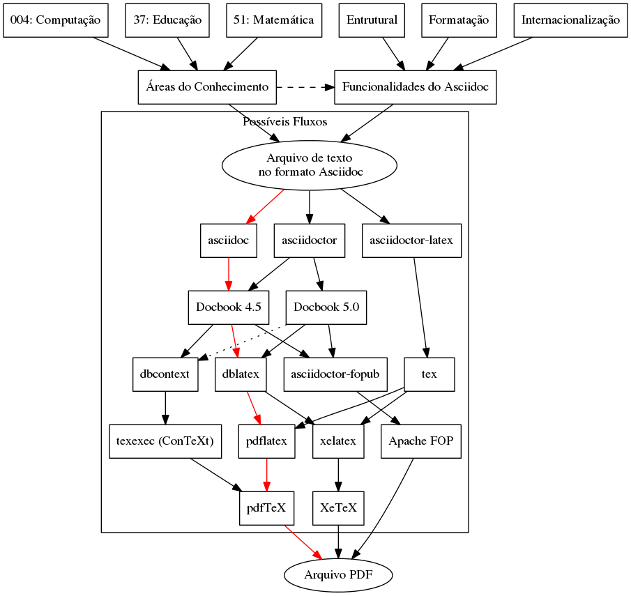

# asciidoc-tool-chains

- There are many ways to build PDFs from a asciidoc file.

- And there are texts from [many areas of knowledge](http://udcdata.info). 

Which toolchains are fine for the area you are writing for? This
project will research this question.

This project is still on alfa stage, many changes will be done.

## Features vs knowledge area

There is to way to test a toolchain for your need:

- Test against each feature you will need
- Test against a [corpora](http://en.wikipedia.org/wiki/Corpus) similar text, in this case texts of the same area of knowledge.

The problem of testing against features is that you may try to look of a "perfect" toolchain, that has more features than of what you need.

The problem of the second approach is to find good texts that uses all the features that the area of text will usually need.

## How this repository is organized

The `config` directory contains configurations.

The `features` directory contains asciidoc files for testing features. Each asciidoc file with its dependencies must be inside a different directory.

**NOTE**: All asciidoc files must be with extension `.adoc`.

The `udc` directory is divided with a language directory. And inside it will have one directory for each digit of the [Universal Decimal Classification system](http://udcdata.info). For example, group [Computer architecture](http://udcdata.info/013566) is classified as `004.2`, then the Portuguese corpora of this area will be save at: `ucd/pt/0/0/4/2`.

## Rake tasks

To see all tasks run:

    $ rake -T
    rake features:asciidoc-docbook45                       # Build feature docbook file
    rake features:asciidoc-docbook45:dbcontext-context     # Build pdf using this toolchain
    rake features:asciidoc-docbook45:dblatex-xetex         # Build pdf using this toolchain
    rake features:asciidoc-docbook45:fopub                 # Build pdf using this toolchain
    rake features:asciidoctor-docbook45                    # Build feature docbook file
    rake features:asciidoctor-docbook45:dbcontext-context  # Build pdf using this toolchain
    rake features:asciidoctor-docbook45:dblatex-pdflatex   # Build pdf using this toolchain
    rake features:asciidoctor-docbook45:dblatex-xetex      # Build pdf using this toolchain
    rake features:asciidoctor-docbook45:fopub              # Build pdf using this toolchain
    rake features:asciidoctor-docbook5                     # Build feature docbook file
    rake features:asciidoctor-docbook5:dblatex-pdflatex    # Build pdf using this toolchain
    rake features:asciidoctor-docbook5:dblatex-xetex       # Build pdf using this toolchain
    rake features:asciidoctor-docbook5:fopub               # Build pdf using this toolchain
    rake features:docbook                                  # Build feature docbook with all engines
    rake features:pdf                                      # Build these pdfs
    rake udc:asciidoc-docbook45                            # Build feature docbook file
    rake udc:asciidoc-docbook45:dbcontext-context          # Build pdf using this toolchain
    rake udc:asciidoc-docbook45:dblatex-xetex              # Build pdf using this toolchain
    rake udc:asciidoc-docbook45:fopub                      # Build pdf using this toolchain
    rake udc:asciidoctor-docbook45                         # Build feature docbook file
    rake udc:asciidoctor-docbook45:dbcontext-context       # Build pdf using this toolchain
    rake udc:asciidoctor-docbook45:dblatex-pdflatex        # Build pdf using this toolchain
    rake udc:asciidoctor-docbook45:dblatex-xetex           # Build pdf using this toolchain
    rake udc:asciidoctor-docbook45:fopub                   # Build pdf using this toolchain
    rake udc:asciidoctor-docbook5                          # Build feature docbook file
    rake udc:asciidoctor-docbook5:dblatex-pdflatex         # Build pdf using this toolchain
    rake udc:asciidoctor-docbook5:dblatex-xetex            # Build pdf using this toolchain
    rake udc:asciidoctor-docbook5:fopub                    # Build pdf using this toolchain
    rake udc:docbook                                       # Build feature docbook with all engines
    rake udc:pdf                                           # Build these pdfs

To look for hidden tasks:

    $ rake -P
    rake features:pdf
        target/features/simple/simple.adoc/dblatex-xetex-from-asciidoc-docbook45.pdf
        target/features/simple/simple.adoc/dbcontext-context-from-asciidoc-docbook45.pdf
        target/features/simple/simple.adoc/fopub-from-asciidoc-docbook45.pdf
        target/features/simple/simple.adoc/dblatex-pdflatex-from-asciidoctor-docbook45.pdf
        target/features/simple/simple.adoc/dblatex-xetex-from-asciidoctor-docbook45.pdf
        target/features/simple/simple.adoc/dbcontext-context-from-asciidoctor-docbook45.pdf
        target/features/simple/simple.adoc/fopub-from-asciidoctor-docbook45.pdf
        target/features/simple/simple.adoc/dblatex-pdflatex-from-asciidoctor-docbook5.pdf
        target/features/simple/simple.adoc/dblatex-xetex-from-asciidoctor-docbook5.pdf
        target/features/simple/simple.adoc/fopub-from-asciidoctor-docbook5.pdf
    rake udc:pdf
        target/udc/pt/3/7/cap3-educacao-sociedade-conteporania.adoc/dblatex-xetex-from-asciidoc-docbook45.pdf
        target/udc/pt/3/7/cap3-educacao-sociedade-conteporania.adoc/dbcontext-context-from-asciidoc-docbook45.pdf
        target/udc/pt/3/7/cap3-educacao-sociedade-conteporania.adoc/fopub-from-asciidoc-docbook45.pdf
        target/udc/pt/3/7/cap3-educacao-sociedade-conteporania.adoc/dblatex-pdflatex-from-asciidoctor-docbook45.pdf
        target/udc/pt/3/7/cap3-educacao-sociedade-conteporania.adoc/dblatex-xetex-from-asciidoctor-docbook45.pdf
        target/udc/pt/3/7/cap3-educacao-sociedade-conteporania.adoc/dbcontext-context-from-asciidoctor-docbook45.pdf
        target/udc/pt/3/7/cap3-educacao-sociedade-conteporania.adoc/fopub-from-asciidoctor-docbook45.pdf
        target/udc/pt/3/7/cap3-educacao-sociedade-conteporania.adoc/dblatex-pdflatex-from-asciidoctor-docbook5.pdf
        target/udc/pt/3/7/cap3-educacao-sociedade-conteporania.adoc/dblatex-xetex-from-asciidoctor-docbook5.pdf
        target/udc/pt/3/7/cap3-educacao-sociedade-conteporania.adoc/fopub-from-asciidoctor-docbook5.pdf

